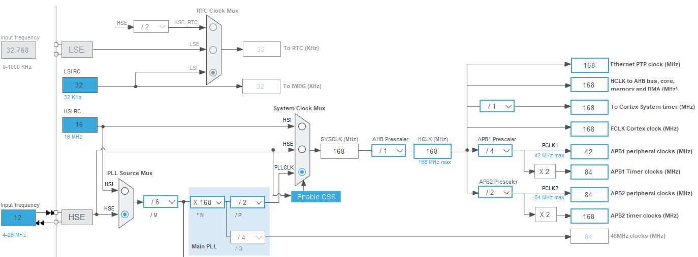

# 开发板 C

## 基本信息
- 芯片型号 STM32F407IGH6
- 处理速度 168M Hz

## STM32CubeMX 设置
- **Pinout & Configuration**
  - RCC
    - High Speed Clock (HSE) = Crystal/Ceramic Resonator (选择高速时钟源)
  - SYS
    - Debug = Serial Wire (选择调试接口)
- **Clock Configuration**
  - Input Frequency = 12 MHz
  - HCLK = 168 MHz
  
- **Project Manager**
  - Code Generator
    - STM32Cube MCU Package and embedded software packs
      - [x] Copy only the necessary library files
    - Generate files
      - [x] Generate peripheral initialization as a pair of '.c/.h' files per peripheral
  
