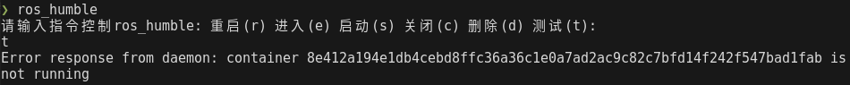
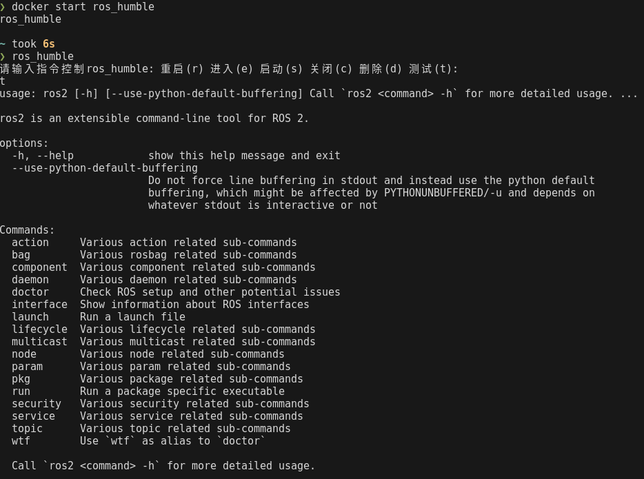

# ROS

## Version
| ROS 版本         | 发行时间         | 结束维护时间     | 适用的 Ubuntu 版本 |
|------------------|------------------|------------------|---------------------|
| **ROS 1 系列**   |                  |                  |                     |
| Indigo Igloo     | 2014年7月        | 2019年5月        | Ubuntu 14.04        |
| Kinetic Kame     | 2016年5月        | 2021年4月        | Ubuntu 16.04        |
| Melodic Morenia  | 2018年5月        | 2023年5月        | Ubuntu 18.04        |
| Noetic Ninjemys  | 2020年5月        | 2025年5月        | Ubuntu 20.04        |
| **ROS 2 系列**   |                  |                  |                     |
| Ardent Apalone   | 2017年12月       | 不再维护         | Ubuntu 16.04        |
| Bouncy Bolson    | 2018年6月        | 不再维护         | Ubuntu 18.04        |
| Crystal Clemmys  | 2018年12月       | 不再维护         | Ubuntu 18.04        |
| Dashing Diademata| 2019年5月        | 2021年5月        | Ubuntu 18.04        |
| Eloquent Elusor  | 2019年11月       | 2021年11月       | Ubuntu 18.04        |
| Foxy Fitzroy     | 2020年6月        | 2023年6月        | Ubuntu 20.04        |
| Galactic Geochelone | 2021年5月     | 2022年11月       | Ubuntu 20.04        |
| Humble Hawksbill | 2022年5月        | 2027年5月        | Ubuntu 22.04        |
| Iron Irwini      | 2023年5月        | 2028年5月        | Ubuntu 22.04        |

## Install 
一键安装 ROS Docker版 (适用于所有版本ROS安装) [fishros.com](https://fishros.com/)  
  
`wget http://fishros.com/install -O fishros && . fishros`  

[Bilibili 解决Docker ROS找不到USB设备与局域网问题](https://www.bilibili.com/video/BV1Eu4y1D76k/?vd_source=4c878cdda4a827e2590557bcbb57b3e5)  

注意: 使用fishros创建的 ros docker需要先使用docker start命令启动容器，然后才可以使用 容器名进行操作

  

